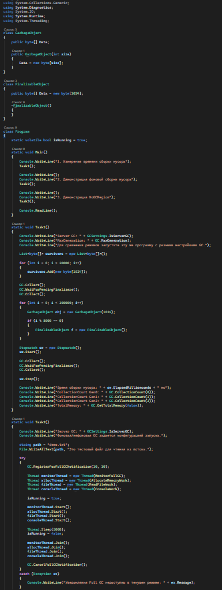
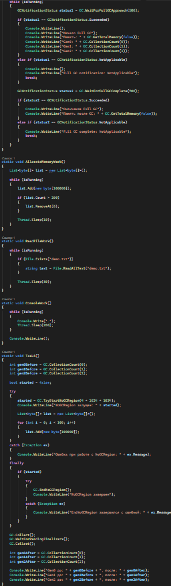
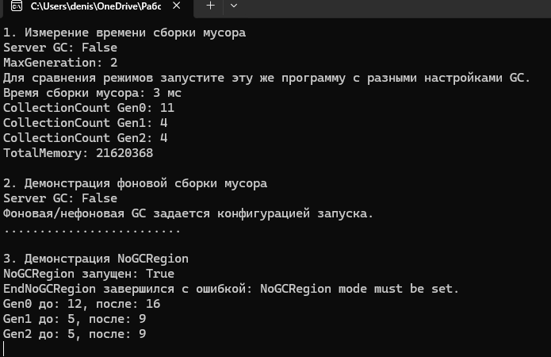

# C# KT16

1. Напишите программу, которая создает большое количество объектов разных поколений и измеряет время, затраченное на сборку мусора в разных режимах: параллельном, фоновом и непараллельном. Для этого используйте класс Stopwatch для измерения времени и методы GC.Collect() и GC.WaitForPendingFinalizers() для запуска и ожидания сборки мусора. Затем сравните результаты и объясните, почему фоновая сборка мусора обычно быстрее параллельной и непараллельной.

2. Напишите программу, которая демонстрирует работу фоновой сборки мусора на рабочей станции и сервере. Для этого используйте параметры конфигурации gcConcurrent и gcServer для включения или отключения фоновой и серверной сборки мусора. Затем создайте несколько потоков, которые выполняют различные задачи, такие как выделение памяти, чтение из файла или вывод на консоль. Используйте метод GC.RegisterForFullGCNotification() для регистрации обратного вызова, который будет вызываться при начале и окончании фоновой сборки мусора. В этом обратном вызове выведите на консоль информацию о текущем поколении, количестве выделенной памяти и состоянии сборки мусора.

3. Напишите программу, которая демонстрирует работу высокоприоритетной сборки мусора во время фоновой сборки мусора. Для этого используйте метод GC.TryStartNoGCRegion() для запрета сборки мусора в определенном участке кода. Затем создайте большое количество объектов в поколении 0 или 1, чтобы вызвать высокоприоритетную сборку мусора. Используйте метод GC.EndNoGCRegion() для завершения запрета сборки мусора. Затем проверьте, возобновилась ли фоновая сборка мусора после высокоприоритетной.

### Код

### Результат

